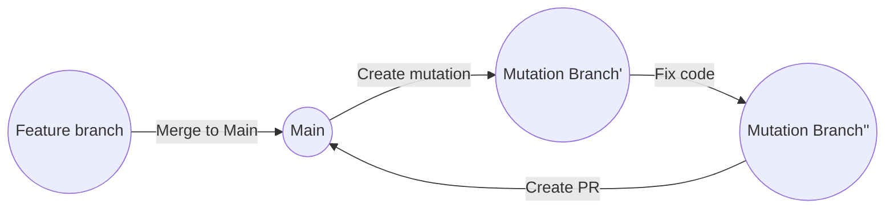

# Project Proposition

We are building a developer tool that strengthens codebases through AI-driven adversarial testing. Each time the `main` branch is updated, a GitHub Action pulls the latest code into a dedicated `mutation` branch. In this branch, the code is intentionally broken by randomly deleting lines, code blocks, or entire files, based on configurable probabilities. An AI agent then attempts to repair the damage by generating a fix, which is committed to the same `mutation` branch. Finally, a pull request is automatically opened from the `mutation` branch back into `main`, allowing developers to review, test, and optionally merge the AI-generated changes.

# Workflow



# How to implement mutation

**Implementation**: Procedural script (deterministic random deletion)

Mutator performs the deletion (there may be different damage levels: 1 line, 1 function, 1 use case).

Mutator marks the location of the mutation by:

- Creating a `.mutation-context.json` file committed to the mutation branch
- This context object contains metadata about mutations (file, type, location, line count) but NOT the deleted content

Dedicated `.mutignore` file to ensure certain files are protected from mutation (including `.mutation-context.json` itself).

# How to implement fix

**Implementation**: LLM (ideally NOT cutting-edge)

Don't cheat! The LLM will be given information pertaining to where the deletion is, but not what was deleted.

Fixer workflow:
1. Checks out the mutation branch
2. Reads `.mutation-context.json` to understand mutation scope and location
3. Receives whole codebase for context (or sufficient sample)
4. Generates and commits the fix to the mutation branch
5. Cannot access git history or the original deleted code

# Development Setup

## Local Development

```bash
# Create virtual environment
python3 -m venv venv

# Activate virtual environment
source venv/bin/activate  # On Windows: venv\Scripts\activate

# Install dependencies
pip install -r requirements.txt

# Set up environment variables (for LLM API keys)
cp .env.example .env  # Edit .env with your API keys
```

## Running Scripts Locally

```bash
# Test mutator
python scripts/mutator.py

# Test fixer
python scripts/fixer.py
```

# Technical Implementation

## GitHub Actions Workflow

The system uses modular GitHub Actions that trigger sequentially:

1. **Trigger Workflow** (`on: push` to `main`)
   - Creates/resets the `mutation` branch from latest `main`

2. **Mutate Workflow**
   - Runs mutator script (procedural deletion)
   - Generates `.mutation-context.json` with mutation metadata
   - Commits mutated code + context file to mutation branch

3. **Fix Workflow**
   - Checks out mutation branch
   - Reads `.mutation-context.json`
   - Calls LLM API to generate fix
   - Commits fix to mutation branch

4. **Create PR Workflow**
   - Reads `.mutation-context.json`
   - Opens PR from `mutation` → `main` with mutation details in description

## Context File Format

`.mutation-context.json` example:
```json
{
  "timestamp": "2025-10-02T17:45:00Z",
  "mutations": [
    {
      "file": "src/utils/helper.js",
      "type": "line",
      "location": "line 42",
      "deletedLineCount": 1
    }
  ],
  "damageLevel": "medium",
  "seed": 12345
}
```

# Stretches:

Different kind of Fixers:

- Aligned with codebase
- Try cutting edge tech
- Conservator approach
