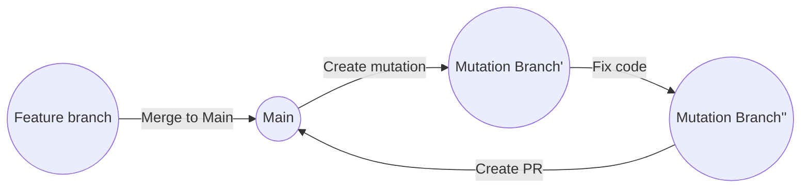

# Project Proposition

We are building a developer tool that strengthens codebases through AI-driven adversarial testing. Each time the `main` branch is updated, a GitHub Action pulls the latest code into a dedicated `mutation` branch. In this branch, the code is intentionally broken by randomly deleting lines, code blocks, or entire files, based on configurable probabilities. An AI agent then attempts to repair the damage by generating a fix, which is committed to the same `mutation` branch. Finally, a pull request is automatically opened from the `mutation` branch back into `main`, allowing developers to review, test, and optionally merge the AI-generated changes.

# Workflow

# How to implement mutation

LLM or procedural?

Mutator performs the deletion (there may be different damage levels: 1 line, 1 function, 1 use case)).

Mutator marks the location of the mutation by:

- Creating a draft PR
- Creating a context. Object that will be transferred to the Fixer.

Dedicated .mutignore file to ensure certain files are protected from mutation.

# How to implement fix

Decide on LLM - ideally NOT cutting-edge

Don’t cheat! The LLM will be given information pertaining to where the deletion is, but not what was deleted.

Fixer receives info regarding where the mutation happened, and whole codebase for context (or, at least, big enough codebase sample).

Fixes the damage.

Updated the draft PR or context.

# Stretches:

Different kind of Fixers:

- Aligned with codebase
- Try cutting edge tech
- Conservator approach
